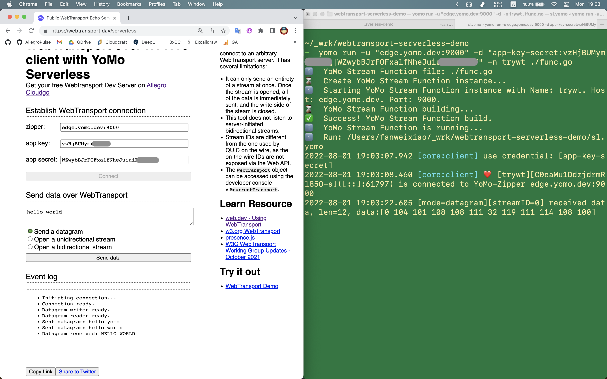

# WebTransport Serverless Demo

1. Open https://webtransport.day/serverless with Chrome latest version (at least verion 98).
1. Click `go to allegro cloud`，reirect to https://allegrocloud.io console.
1. Click `Sign Up` -> `Continue With GitHub` to login with your Github Account.
1. Click `+ New Project` to create a new Geo-distributed Service.
1. In the detail page of project, you will get `Zipper Address`, `App Key` and `App Secret`.
1. Back to https://webtransport.day/serverless and paste values.
1. Click `Connect` to create the webtransport connection.
1. Type `hello world` below `Send data over WebTransport`.
1. Click `Send data`, will see `Sent datagram: hello world` in `Event Log`, but there are no response.
1. Clone this repo `gh repo clone fanweixiao/webtransport-serverless-demo` and open it in your favorite terminal.
1. Install `YoMo CLI`: `$ curl -fsSL "https://bina.egoist.sh/yomorun/cli?name=yomo" | sh`
1. Run `yomo run -u "edge.yomo.dev:9000" -d "app-key-secret:${YOUR_APP_KEY}|${YOUR_APP_SECRET}" -n testwt ./func.go`
1. Back to Chrome, Click `Send data`, will see the response `Datagram received: HELLO WORLD` in `Event Log`.
